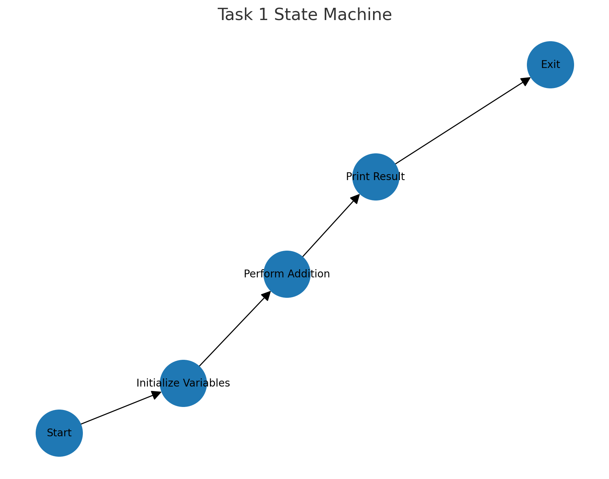
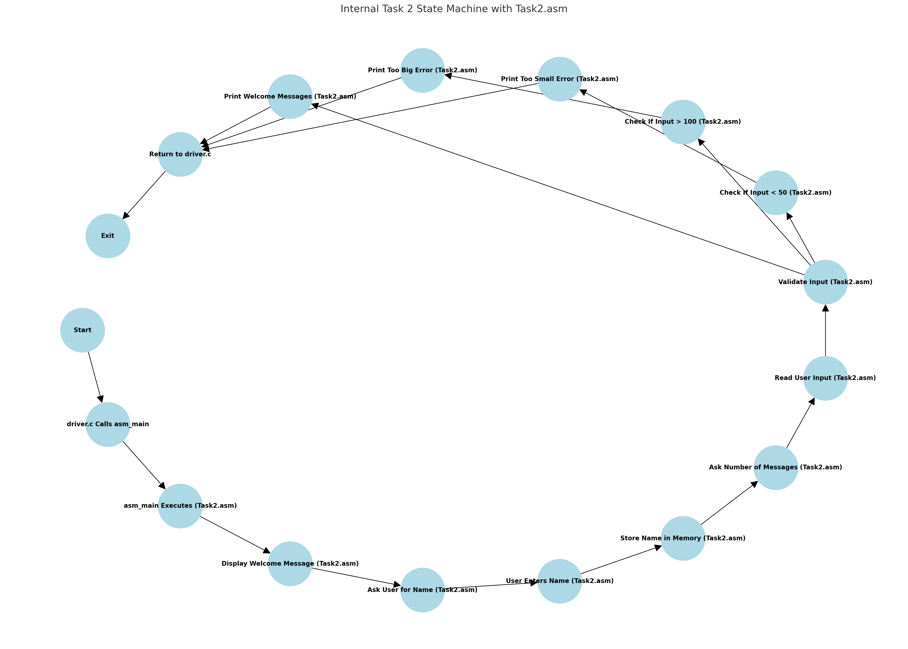
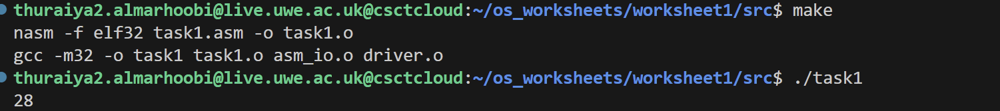
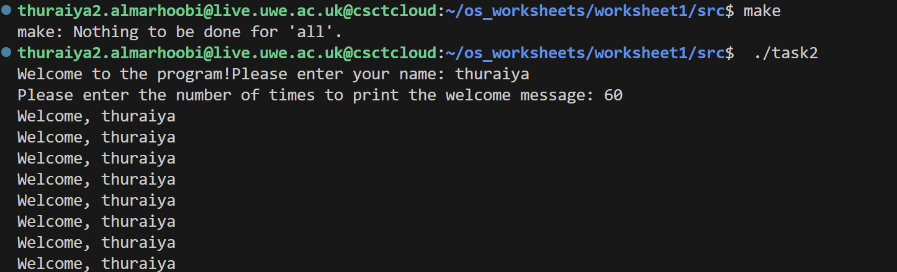
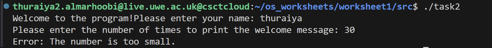
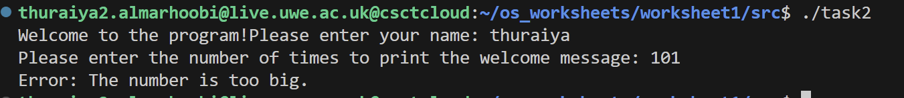
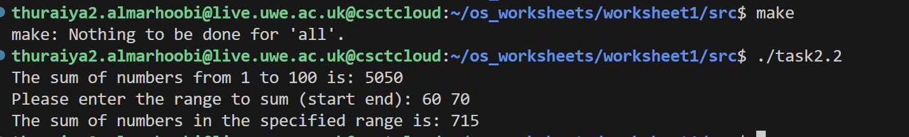
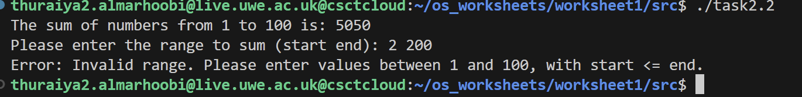

# Overview of worksheet1
please see directory **worksheet1** for ws1 , **worksheet2** for ws2 part 1 and **worksheet2p2** for ws2 part 2 

**before starting these are three state machines showing the work flow of each task in worksheet1 (task1 , task2,task2.2):**

## task 1 

The goal of Task 1 was to create a program in assembly language to add two numbers stored in memory and display the result. The program uses a combination of assembly files, an external I/O library, and a C file to connect and execute everything.

#### Files of task1:
1. task1.asm:
- This file contains an assembly program designed to perform a simple arithmetic operation. Specifically, it calculates the sum of two integers, stores the result, and prints it to the console 
- begins by ` %include "asm_io.inc`  including asm_io.inc (line1), which provides defininitons for external I/O functions like `print_int` from the file asm.io.inc.For example, the `print_int` function in this file is used to display the result of the addition.
2. asm_io.asm:
 - The asm_io.asm file provides ready-made tools for input and output in assembly programs. It includes functions to:

    - Read integers and characters from the user.
Print integers, strings, and characters to the screen.
    - Print a newline for better formatting.
    - Debug your program by showing the state of registers, memory, and the stack.
- instead of writing these functions yourself, you can simply use them in your program by declaring them with extern (e.g., extern print_int) and calling them
2. asm_io.inc 
- (External Include File):This file defines shortcuts for commonly used assembly code and declares the external functions
 from asm_io.asm.It simplifies the use of the I/O functions in your program.

 4. driver.c :
 -   acts as a bridge between the assembly code and the C runtime environment. It initializes the program and ensures that the result of asm_main can be passed back to the system.

 ### description of task1
 1. Data Section
-  `.data` section defines static data:

    - Two variables, `integer1` and `integer2`, are initialized with values 20 and 8, respectively.
    - `dd` (define double-word) is used to allocate 4 bytes (32 bits) of memory for each variable.

2. BSS Section
- The `.bss` section reserves space for an uninitialized variable:
    - The result variable is reserved using `resd`, which does not initialize the variable, unlike `dd`.

3. Text Section (instruction Code)

-  `asm_main` is declared as the program entry point, making it accessible from external files like `driver.c`.
- Register Operations:
    - `pusha` saves all registers before computation starts to preserve the original state.
    - `mov` retrieves the value of integer1 from memory into the eax register.
    - `add` adds the value of `integer2` to the value in `eax`.
The result is stored in the `result` variable.
Code snippet:

            mov eax, [integer1]
            add eax, [integer2]
            mov [result], eax
    - `popa` restores all registers to their original state after computation.
- **Output**:
- The `print_int` function is called to display the sum stored in `eax`.
- The program sets `eax` to 0 for  successful execution.

5. Driver Code

`driver.c` declares the `asm_main` function with `cdecl` using this line:

`int __attribute__((cdecl)) asm_main( void );`
- This ensures compatibility between C code and the assembly function for passing data.

- The `asm_main` function is invoked to execute the assembly code.

- `ret_status` receives the value returned by `asm_main` and passes it back to the operating system as the program's exit status.

### running the code

before creating the Makefile which was in task3 , these commands were used by order to run the code  :
1. `nasm -f elf32 task1.asm -o task1.o`
- nasm, the command assembles your assembly code into a machine-readable object file that can later be linked with other files to create an executable program.
- task1.asm : the file that needs an object
- -o task1.o :specifies the output object file.
2. `nasm -f elf32 asm_io.asm -o asm_io.o`
- here we created an object as the first command . however for the asm_io.asm file
3. `gcc -m32 -c driver.c -o driver.o`
- Compiles the driver.c file into a 32-bit object file called driver.o. and when compiling a c file , gcc is used instead of nasm
- -c: Only compile the code into an object file without linking.
- This step compiles the driver.c file into machine code but doesn’t create the final executable yet.
4. `gcc -m32 -o task1 task1.o driver.o asm_io.o`
- Links all the object files (task1.o, driver.o, asm_io.o) into a single executable named task1.
At this stage, all the separate parts of your program (assembly code, C code, and I/O routines) are combined into a complete  program.
5. `./task1`
- ./: Tells the shell to run the task1 program from the current directory.
- When you run this, the program executes the combined code from task1.asm, asm_io.asm, and driver.c.

all these commands were saved in a makefile later as seen in the image below . and the output expected was 28 based on the integers we summed making sure we are in the right directory to run.

# task 2
#### Overview:
The task involves implementing loops and conditionals in assembly language to perform various operations, including user input, validation, and array manipulation.These concepts are based on Sections 2.2 and 2.3 of the PC Assembly Language 
book.

for **task2** i have split it into: 
1. **task2.asm**
-    to write an assembler program that asks the user for their name and the number of timest to
 print a welcome message, has to be in the range of 50-100 times
 2.  **task2.2.asm** 
 -  covered an assembler program that defines an array of 100 elements,initialize the array to the numbers
 1 to 100,and then sum the that array,
 also, asks the user to enter a range to sum, checking the
 range is valid, and then display the sum of that range.
#### goal
- The goal of this task is to Gain a deeper understanding of how loops and conditionals work in assembly language.
- Translate logical constructs from C to assembly code.
Write assembly programs that can handle user input, validate data, manipulate arrays, and perform  operations.

### files used in task2
1. external files : 
- asm_io.asm and asm_io.inc : same files that was explained in task1
2. driver.c: same driver.c that was used in task1
2. task2.asm :
- This file contains an assembly program designed to interact with the user, validate input, and perform a repetitive task based on user input. It demonstrates how to handle loops, conditionals, and user interaction in assembly language.
3. task2.2.asm:
- This file contains an assembly program that initializes an array, calculates sums, and interacts with the user to perform custom range-based summation. It demonstrates the use of loops, conditional validation, and input/output operations in assembly language. 
### desctiption of task2.asm

The program starts by using asm_io.inc, which provides prewritten functions like print_string (for printing strings), read_int (for reading integers), and read_char (for reading characters). These functions handle input and output operations, simplifying the assembly code. For example, the print_string function is called multiple times to display messages to the user:

#### Data Section (.data)
- The .data section contains predefined strings and messages used throughout the program. These are constant values that do not change during the program's execution. for example , in line 2 `welcome_msg db 'Welcome to the program!', 0`  the purpose here is to display this message at first.

- there are some syntax elements that are used here and each have a meaning :
    -  db : it is used in line 4-8 after defining the variable name , and it is used for strings or individual characters through creating a sequence of bytes for the string mentioned after db.and This tells the assembler to create a series of bytes in memory.Each value following db is stored as one byte
    - 0 : zero at the end of the line means the end of the string.
    - 0xA: This is the ASCII code for a newline character (\n). whenever it is used the program knows to move the cursor to the next line and assign it to newline in line9 (`newline db 0xA, 0`)

#### Section (.bss)
Used to define uninitialized variables. Variables in .bss do not have predefined values. They are typically initialized to zero.this is mainly For buffers, counters, or arrays that will be assigned values during runtime.For exaple , `name resb 50 `. it simply reserving 50 bytes for storing a name using resb (reserve byte).

#### Section .text
This section contains the actual code of the program. It is divided into multiple functional parts.
global asm_main: Declares asm_main as the entry point of the program, which will be called from driver.c.
asm_main:: Marks the start of the main function.
the functional parts:
1. asm_main
#### Register Preservation and Welcome Message
- The program begins with the `pusha` instruction:
    - Saves all general-purpose registers onto the stack to preserve their original values for later use.
- Displaying Welcome Message:
    - `mov eax, welcome_msg` loads the address of the string `welcome_msg` (predefined welcome message) into the eax register.
    - `call print_string` calls the `print_string` function (from `asm_io.inc`) to display the welcome message on the console.
- Prompt for Name:
    - ` mov eax, ask_name_msg` instruction loads the address of the `ask_name_msg` (prompt asking for the user's name) into `eax`.
    - `call print_string` displays the name prompt to the user.
#### Reading User Input
- Reading Name:
    - `mov eax, name` loads the address of the name buffer into `eax`.
    - `call read_name` reads the user’s input character by character and stores it in the `name` buffer.
- Prompt for number Input:
    - `mov eax, ask_count_msg` loads the prompt message asking for the number of repetitions into `eax`.
    - `call print_string` displays this. 

    - `call read_int `reads the user's numeric input and stores it in the count variable using `mov [count], eax`.
#### Input Validation
- Check if Input is Less than 50:
    - `mov eax, [count]` loads the user’s input from the count variable into `eax`.
    - `cmp eax, 50` compares the input with 50.
    - If the input is less than 50, `jl print_too_small` jumps to the `print_too_small` label, where an error message is displayed.
    - `jl` (Jump if Less) is used after a comparison (`cm`p) when the first value is less than the second.
- Check if Input is Greater than 100:
    - `cmp eax, 100` compares the input with 100.
    - If the input is greater than 100, `jg print_too_big` jumps to the print_too_big label, where another error message is displayed.
    - `jg` (Jump if Greater) is used after `cmp` when the first value is greater than the second.
2. print_welcome_loop:
-  this function, is for to print the welcome message multiple times until the count is zero. It begins by loading the address of the  `welcome_format ` string into the  `eax ` register  and  `calling print_string ` to display "Welcome, " on the console. Next(line 48), it loads the user’s name into eax and calls  `print_string ` again to print the name. in **line(50)** loading the newline character (\n) into  `eax ` and printing it to move the cursor to the next line.

- The instruction  `dec dword [count] `  decreases the count by 1 using dec instruction, and  `cmp dword [count] `,
      0 checks if the count is greater than zero. If it is, the  `jg print_welcome_loop ` instruction 
      causes the program to jump back to the  `print_welcome_loop ` label, repeating the process. 
      This loop continues until the count becomes zero,
        where the program exits the loop and moves to the next instruction.

        
- print_welcome_loop is not defined elsewhere because it doesn’t need to be. In assembly, labels like print_welcome_loop are simply markers in the code, and they are "declared" the moment you write them, followed by a colon :

3.print_too_small:
- Error Message Display:

    - The section starts with `mov eax, too_small_msg`, which loads the address of the `too_small_msg` string containing the error message `"Error: The number is too small."` into the `eax` register.
    - The `call print_string` instruction is used to display this message on the console.
- Formatting the Output:

    - `mov eax, newline` loads the newline character (\n) into the `eax` register.
    - Another `call print_string` moves the cursor to the next line to ensure proper formatting.
- Exiting the Program:

    - The `jmp Exit_program` instruction jumps to the Exit_program label to terminate the program gracefully after displaying the error message.

4.print_too_big:
- The print_too_big section handles the case where the user's input is greater than 100. 
    - It starts by loading the address of the `too_big_msg` string, which contains the error message `"Error: The number is too big."`, into the `eax` register. 

    - The `call print_string` instruction displays this error message on the console. Then, the newline character (\n) is loaded into `eax`, and `all print_string` is  to print it, ensuring the output is formatted properly.

    -  Finally, the `jmp Exit_program `instruction takes the program to the `Exit_program` label, ending the program properly after showing the error message.

5. Exit_program:
- The `Exit_program` section ensures the program ends cleanly. It begins with the `popa` instruction **line 74**, which restores all the general-purpose registers that were saved with `pusha`, ensuring that the program's register state is consistent. Next, the `mov eax, 0` instruction sets the return value of the program to 0,  meaning successful execution. Finally, the `ret` instruction returns control to the calling function (driver.c), signaling the program's termination.

6. read_name:
- This part of the code only has two instructions. begins by using the `pusha` instruction to save all general-purpose registers to the stack,  so that their original values are preserved and can be restored later. and the second instruction is ` mov ecx, 0` which initializes the `ecx` register to zero, preparing it to be used as a counter or index for  operations in the program.

7. `read_loop`
- Reading Characters:

    - The loop starts with `call read_char`, which reads a single character from the user and stores it in the `al` register.
- Checking for Newline:

    - The instruction `cmp al, 0xA` compares the character in the `al` register with `0xA`, the ASCII code for a newline (\n).
    - If a newline is detected, the `je done_reading` instruction jumps to the `done_reading` label, signaling the end of the input loop.
- Storing the Character:

    - `mov [name + ecx], al` stores the current character in the name buffer at the position specified by the `ecx` register.
- Advancing the Buffer Index:

    - The `inc ecx` instruction increments the `ecx` register to point to the next position in the name buffer.
- Continuing the Loop:

    - `jmp read_loop` jumps back to the beginning of the loop, allowing the next character to be read and processed.
- Loop Termination:

    - The process repeats until a newline is encountered, at which point the loop exits.

8. done_reading:
- the last section  section finalizes the process of reading the user's input. The instruction `mov byte [name + ecx], 0` places a null terminator (0) at the end of the name buffer, marking the end of the string for proper string handling. Following this, the `popa` instruction restores all previously saved general-purpose registers from the stack, ensuring that the program's register state is returned to its original condition. Finally, the `ret` instruction ends the function and returns control to the calling code, signaling the completion of the name-reading process.

### output expected for task2.asm 
 commands used to run task2.asm:
`nasm -f elf32 task2.asm -o task2.o`
`nasm -f elf32 asm_io.asm -o asm_io.o`
`gcc -m32 -c driver.c -o driver.o`
`gcc -m32 -o task2 task2.o driver.o asm_io.o`
`./task2`
all these commands were saved in a makefile later as seen in the images below . and the output expected was  based on the integers we summed making sure we are in the right directory to run.

a screenshot of an output if the user inputs number of times to print the welcome message within the range:

a screen=shot of an output if the user inputs number of times to print the welcome message less than the range (50-100)

a screenshot of an output if the user inputs number of times to print the welcome message larger than the range (50-100)

### Dscription task2.2.asm
This task involves creating an assembly program that performs operations on an array of integers. 
The program first defines an array of 100 elements and initializes it with consecutive numbers from 1
 to 100. It then calculates the sum of all the elements in the 
 array. Additionally, the program allows the user to specify a 
 range  within the array,the system validates the input range, and calculates the sum of the elements within that specified range.
The program ensures that the input range is valid (e.g., indices between 1 and 100, with the start index less than or equal to
the end index). this is implemented using task2.2.asm which is split into sections after including asm_io_inc in the frst line.

1. data section :

- `result_msg db 'The sum of numbers from 1 to 100 is: ', 0`:
This string holds the message used to indicate the result of summing all the elements in the array using db. The 0 signaling the end of the string.

- `range_msg db 'Please enter the range to sum (start end): ', 0:`
This string is a prompt for the user, asking them to input the start and end indices of the range they want to sum. The null  (0) ensures proper string handling.

- `invalid_range_msg db 'Error: Invalid range. Please enter values between 1 and 100, with start <= end.', 0:`
This error message is displayed when the user provides an invalid range, such as  outside the range of 1 to 100 or when the start index is greater than the end index. 

- `range_sum_msg db 'The sum of numbers in the specified range is: ', 0:`
This string is used to display the result of summing the numbers within the range specified by the user. The null terminator ensures the string is printed correctly.

- `newline db 0xA, 0:`
This defines a newline character (\n) using its ASCII code (0xA). The 0 null terminator ensures that it functions correctly.

2. bss section :

The .bss section is used to reserve memory for variables that do not have an initial value. These variables will be assigned values during runtime.

- `array resd 100:`
Reserves space for an array of 100 integers using resd. Each integer is 4 bytes, making the total size 400 bytes. This array will hold the numbers 1 to 100.

- `sum resd 1:`
Reserves space for a single integer to store the total sum of the numbers in the array.

- `start resd 1:`
Reserves space for the starting index of the user-specified range.
- `end resd 1:`
Reserves space for the ending index of the user-specified range.

3. text section:

The .text section contains the executable instructions for the program. It defines initialization, calculations, input handling. This is where the actual execution of the program occurs.

- `global asm_main:`
This declares asm_main as the entry point of the program. It makes asm_main accessible to the external `driver.c` file, which calls this function to start the program.

- `asm_main:`
The asm_main label marks the beginning of the program's main function. It contains the core instructions, including saving registers `(pusha)`.

- `inisialize_array` label:

initialize_array: 

    inc ecx                  
    mov [array + (ecx - 1) * 4], ecx  [ECX - 1]
    cmp ecx, 100             
    jl initialize_array  

This code initializes an array with integers from 1 to 100. It starts with ecx set to 0 and enters a loop marked by the initialize_array label and . Each iteration increments `ecx` using `inc` and calculates the address for the current array index, storing the value of ecx there. The loop continues as long as ecx is less than 100, checked by `cmp ecx, 100` and jl initialize_array. When ecx reaches 100, the loop ends, completing the initialization.  

- calculating the total sum:

mov ecx, 0 

mov eax, 0 

   sum_array: 

    add eax, [array + ecx * 4]   
    inc ecx                      
    cmp ecx, 100                  
    jl sum_array                 
    mov [sum], eax  
 This code calculates the sum of all elements in the array. It resets `ecx` to 0 as a counter and initializes `eax` to 0 to store the sum. In the loop, each array element is added to `eax`, and ecx is incremented to process the next element. The loop repeats until ecx reaches 100, at which point the total sum in eax is stored in the sum variable.
 
  `[array + ecx * 4]` calculates the memory address of the ecxth element in the array, where array is the base address. Multiplying ecx by 4 accounts for each element being 4 bytes (32-bit integer), and the value at the calculated address is accessed.   
- **output the total sum:**

mov eax, result_msg 

    call print_string  

    mov eax, [sum]

    call print_int

    mov eax, newline

    call print_string         

    mov eax, range_msg
    call print_string  

This code outputs the total sum of the array and prompts the user for a range to sum. First, `mov eax, result_msg` loads the address of the message string into `eax`, and `call print_string` displays the message on the console. Then, `mov eax, [sum]` loads the calculated sum from memory into eax, and `call print_int `prints the  value. `mov eax, newline` loads a newline character into eax, and `call print_string` moves the output to the next line. Next, the program prompts the user to enter a range by loading the `range_msg` into eax and displaying it using `call print_string`.   

- **read start and end of the range and validate it line53-73**
this part( i did not put the code as its long) ,  First, call `read_int` reads an integer input from the user, and `mov [start], eax` stores it in the start variable. The process is repeated for the end of the range with `mov [end], eax`. To validate the range, the program checks if the start is greater than or equal to 1 using `cmp eax, 1`, jumping to `invalid_range` if it is less. Similarly, `cmp eax, 100` ensures the end value is less than or equal to 100, and the program jumps to `invalid_range` if it exceeds this limit. Finally, the program compares the start and end values using `mov` and `cmp`; if the start is greater than the end, it also jumps to `invalid_range`.

- **Range Sum Calculation (range_sum) line75-85**

This label calculates the sum of the array elements within the
user-specified range. It starts by loading the start index into
`ecx` and adjusting it for 0-based indexing using `dec ecx`. 
The `edx` register is initialized to 0 to accumulate the sum.
In the loop labeled `range_sum`, the value of the current array
element `([array + ecx * 4])` is added to `edx`, and `ecx` is incremented
to move to the next element. The end index is loaded into `ebx` and  
adjusted for 0-based indexing with `dec ebx`. **The loop continues as long as `ecx`
is less than or equal to `ebx`**, checked using `cmp ecx, ebx` and `jle range_sum.`
 Once the loop completes, the sum of the specified range is stored in `edx`.

- **Range Sum Output line87-95** 

After the range sum is calculated, the program outputs the result.

  1. The `range_sum_msg` string, which contains the message `"The sum of numbers in the specified range is: ",` is loaded into `eax` and displayed.

  2. using `call print_string.` The total sum stored in `edx` is then loaded into `eax` and printed with `call print_int`. 

  3.  a newline character is printed after that 
   `using mov eax, newline` and `call print_string`. 
   Once the output is complete, the program jumps to `Exit_program` to end execution.
4. Invalid Range Handling (invalid_range):
    - If the user specifies an invalid range, the program jumps to the invalid_range label. Here, the error message stored in invalid_range_msg is loaded into eax and printed using call print_string. 
    - A newline character is printed afterward to maintain clean output formatting. This provides clear feedback to the user about the invalid input.

Program Exit (Exit_program)
 the program ensures a clean exit.
The `popa` instruction restores all registers previously saved
with `pusha`. Then, `mov
eax, 0` sets the return value to indicate successful execution,
and the `ret` instruction ends the program.

#### Expected Output
- Total Array Sum: The program calculates and stores the sum of all numbers from 1 to 100.(5050)

- Range Sum: After the user specifies a valid range, the program calculates and stores the sum of the elements within that range.

### running the code

before creating the Makefile which was in task3 , these commands were used by order to run the code **(explained in task1 )**  :
1. `nasm -f elf32 task2.2.asm -o task2.2.o`
2. `nasm -f elf32 asm_io.asm -o asm_io.o`
3. `gcc -m32 -c driver.c -o driver.o`
4. `gcc -m32 -o task2.2 task2.2.o driver.o asm_io.o`
5. `./task2.2`

all these commands were saved in a makefile later as seen in the image below .
- **output if the user entered the a number within the range :** 

- **output if the user entered a range outside 1-100:**

# task 3
### Creating a makefile

A Makefile is a file used by the make build tool to automate the compilation and linking process for programs. It has rules to specify how files depend on each other and the commands needed to build or clean the project. Also, it saves time for the user to use all the commands by one to compile the code

### Purpose of the Makefile

1. Assembling the assembly files (task1.asm and asm_io.asm).
2. Compiling the C file (driver.c).
3. Linking all the object files to create the final executable (task1).
4. Providing a clean target to remove compiled files and start fresh.

- Key Parts of the Code
Compiler and Assembler Definitions:

`CC = gcc`

`ASM = nasm`

**CC**: Specifies the C compiler to be used, which is gcc (GNU Compiler Collection).
**ASM**: Specifies the assembler, which is nasm (Netwide Assembler).These definitions simplify the commands by allowing you to use $(CC) and $(ASM) in the rules.

- Flags for Compilation and Assembly

`CFLAGS = -m32 -c`

`AFLAGS = -f elf32`

**CFLAGS**: Options for the C compiler:

    -m32: Compiles the code as 32-bit.

    -c: Tells the compiler to produce object files (.o) but not link them.

**AFLAGS:** Options for the assembler:

    -f elf32: Specifies that the assembler should generate a 32-bit ELF format object file.

- Target Definitions

`TARGET1 = task1`
`TARGET2 = task2`
`TARGET2_2 = task2.2`

    These define the names of the final executables for each task:
    task1: The executable for Task 1.
    task2: The executable for Task 2.
    task2.2: The executable for Task 2.2.
- Default Rule

`all: $(TARGET1) $(TARGET2) $(TARGET2_2)`

    The all rule specifies that running make by default will build all three targets (task1, task2, and task2.2).
- Rules for Building Executables

`$(TARGET2_2): $(OBJS2_2)`

`$(CC) -m32 -o $(TARGET2_2) $(OBJS2_2)`

    What It Does:
    Links the object files listed in OBJS2_2 (task2.2.o, asm_io.o, driver.o) to produce the executable task2.2.
    $(CC) invokes the C compiler for linking.
    -m32 ensures the output is 32-bit.
- Rules for Assembling .asm Files

`task2.2.o: task2.2.asm`

`$(ASM) $(AFLAGS) task2.2.asm -o task2.2.o`

    What It Does:
    Uses nasm to assemble the source file task2.2.asm into the object file task2.2.o.
    $(AFLAGS) applies the assembler flags (-f elf32) to ensure the correct format.
- Rules for Compiling .c Files

`driver.o: driver.c`
	`$(CC) $(CFLAGS) driver.c -o driver.o`

    What It Does:
    Compiles the C source file driver.c into the object file driver.o.
    $(CFLAGS) ensures that it’s compiled as a 32-bit object file without linking.
- Clean Rule

`clean:`
	`rm -f *.o $(TARGET1) $(TARGET2) $(TARGET2_2)`

    What It Does:
    Deletes all object files (*.o) and the executables (task1, task2, task2.2).
    Allows for a fresh rebuild of the project.
- Phony Targets

`.PHONY: clean all`

    What It Does:
    Marks clean and all as phony targets to prevent make from confusing them with real files of the same name.

