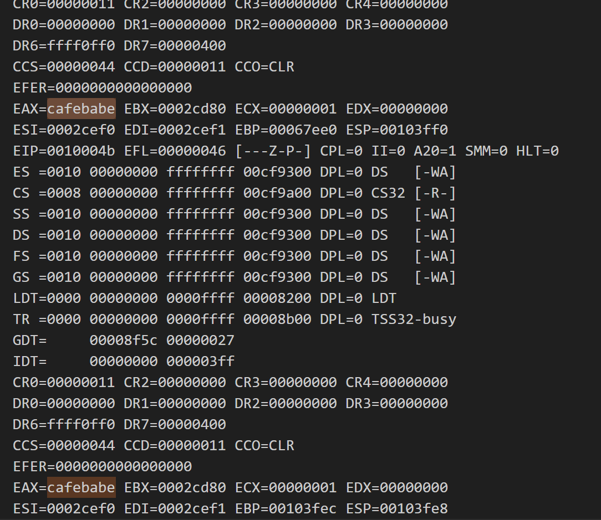

# Overview of worksheet2 

please see directory **worksheet1/src** for ws1 , **worksheet2** for ws2 part 1 and **worksheet2p2** for ws2 part 2. each have their own README.MD

This worksheet guides you step-by-step in building a simple operating system:

**Task 1:** You start by setting up the basic folder structure and writing a small kernel in assembly language. This kernel does one simple thing: it writes the number 0xCAFEBABE to the eax register and loops forever. You use GRUB to load the kernel and test it using QEMU. A custom linker script ensures the kernel is loaded into the right memory location.

**Task 2:** You extend the kernel to call C functions. For example, you create a function to add three numbers and at least two more C functions of your choice. The Makefile is updated to handle both assembly and C files, showing how to combine them.

**Task 3:** You learn how to display text on the screen using a framebuffer driver. This allows you to print text, move the cursor, and set text colors. You also test your kernel in QEMU's Curses mode and control it using Telnet. The Makefile is updated to include these new features.

 **structure the workflow into logical stages:**

1. Bootstrapping (loader.asm, link.ld, menu.lst).

2. Transition to C (loader.asm, kmain.c).

3. Adding I/O (framebuffer.c).

4. Building and testing (Makefile).

## Files Used
Here is the list of files used throughout the tasks in this worksheet:

1. source/loader.asm:
The main assembly file that initializes the OS and transitions control to the kernel.

2. source/link.ld:
A linker script used to properly align memory and define where the kernel is loaded.

3. source/kmain.c:
The kernel's main entry point in C, responsible for initializing the kernel and setting up functionality.

4. drivers/framebuffer.c:
A file introduced in Task 3 to handle basic framebuffer I/O operations, such as printing text and controlling the cursor for task3

5. drivers/framebuffer.h

`framebuffer.h` is  for Task 3 because it connects kmain.c to the framebuffer functionality provided by `framebuffer.c`. Without it, kmain would not know how to use functions like `fb_clear` or `fb_write_cell`. This file is a critical part of the workflow for enabling basic I/O through the framebuffer.

5. iso/boot/grub/menu.lst:
A GRUB configuration file that specifies where the kernel is located and sets GRUB boot options.

6. iso/boot/grub/stage2_eltorito:
A GRUB file required for booting the OS.

7. kernel.elf:
The compiled kernel executable created during the build process.

8. Makefile:
Automates the compilation, linking, and ISO generation process for the OS.

# Task1 
The process begins by setting up a minimal operating system that writes the value 0xCAFEBABE to the eax register and loops indefinitely. This foundational task demonstrates how to boot a machine from scratch and sets the stage for future development. 

1.  `loader.asm` file:
the code that is responsible for task1 :
```
{
        MAGIC_NUMBER equ 0x1BADB002
        FLAGS equ 0x0
        CHECKSUM equ -(MAGIC_NUMBER + FLAGS)

        section .text
        align 4
        dd MAGIC_NUMBER
        dd FLAGS
        dd CHECKSUM

        loader:
            ; Debug: Write 0xCAFEBABE to eax
            mov eax, 0xCAFEBABE

        .loop:
            jmp .loop          ; Infinite loop
 }
```

   - The code responsible for Task 1 sets up a minimal kernel that writes the hexadecimal value 0xCAFEBABE to the eax register and then loops indefinitely. This kernel demonstrates the basic functionality of bootstrapping an operating system. 

 how it works:

 - Multiboot Setup:

The `MAGIC_NUMBER`, `FLAGS`, and `CHECKSUM` are defined as part of the multiboot specification, ensuring that GRUB recognizes the kernel as a valid operating system.

Without this setup, GRUB cannot load the kernel, making the operating system non-functional. This is why the MAGIC_NUMBER, FLAGS, and CHECKSUM must be defined precisely at the beginning of the kernel's .text section.

- **Kernel Entry Point (loader):**

The `loader` label is the starting point of the kernel, defined as the entry point in the  script. 

- **Core Task (Debugging Value):**

The instruction `mov eax, 0xCAFEBABE` writes the value `0xCAFEBABE` into the `eax` register, a simple yet essential operation to confirm that the kernel has successfully booted and is executing.

- **Infinite Loop:**

The `.loop` label ensures that the kernel does not terminate or proceed further.This is achieved by an unconditional `jump (jmp .loop)`, which keeps the system in a consistent state.
This setup demonstrates how to create a basic kernel, which is essential for understanding bootstrapping and serves as the foundation for expanding the operating system in other tasks.

2. `link.ld` Linking the Kernel

        The link.ld file is important for Task 1 because
        The ENTRY(loader) in link.ld specifies that the execution starts at the loader label in loader.asm. it helps prepare the kernel (loader.asm) for GRUB to load and run. It sets the starting point of the kernel at the loader label and makes sure the kernel is loaded into memory at the correct location, as required by GRUB. The file organizes different parts of the program, like the code, constants, and variables, into sections, aligning them properly for the system to work efficiently. This script is used to create the kernel.elf file, to writing 0xCAFEBABE to the eax register in Task 1.
 ### **Key Components in link.ld**
- ENTRY(loader):

Specifies the entry point of the kernel, which is the loader label defined in loader.asm.
 it starts execution at this entry point.
 
- Memory Layout (SECTIONS):

The SECTIONS block organizes how different sections of the kernel are loaded into memory.

  `Start Address (. = 0x00100000):`

Specifies that the kernel code should be loaded starting at 1 MB.
This is necessary because lower memory (below 1 MB) is reserved for GRUB, BIOS, and memory-mapped I/O.

`Text Section (.text):`

Contains executable code (e.g., instructions in loader.asm).
Aligned at 4 KB to optimize memory access and meet CPU alignment requirements.

`Read-Only Data Section (.rodata):`

Holds constant data that cannot be modified, such as string literals.Aligned at 4 KB.
Includes all .rodata sections using *(.rodata*).

`Data Section (.data):`

Contains initialized global and static variables.
Aligned at 4 KB.
Includes all .data sections using *(.data).

`BSS Section (.bss):`

Contains uninitialized global and static variables.
Aligned at 4 KB.
Includes all .bss sections and COMMON symbols from object 

3. Setting up GRUB

To set up `GRUB`, creating the `iso/boot/grub` directory was needed and place two files inside it: `menu.lst` and `stage2_eltorito`. The `menu.lst` file is a `GRUB` configuration file that tells `GRUB` where to find the kernel `(/boot/kernel.elf)` and sets boot options, such as starting automatically (default=0) with no delay `(timeout=0)`. The `stage2_eltorito` file is required by GRUB to handle the boot process. These files ensure that GRUB can load and execute the kernel properly.

4. Building and Running the OS

commands used inside the make file : 

`nasm -f elf source/loader.asm -o source/loader.o`

Assembles the loader.asm file into an object file (loader.o) in ELF format, which is compatible with linking.


`cp kernel.elf iso/boot/`

Copies the compiled kernel (kernel.elf) to the iso/boot/ directory to be included in the bootable ISO.

`ld -T link.ld -melf_i386 loader.o -o kernel.elf`

Links the loader.o object file using the link.ld script to create the kernel executable (kernel.elf) in ELF format.

`genisoimage -R -b boot/grub/stage2_eltorito -no-emul-boot -boot-load-size 4 -A os -input-charset utf8 -quiet -boot-info-table -o os.iso iso`

Creates a bootable ISO file (os.iso) from the iso/ directory.

`qemu-system-i386 -nographic -boot d -cdrom os.iso -m 32 -d cpu -D logQ.txt`

Runs the ISO in QEMU, a virtual machine for testing the OS.Using `QEMU` to  verify that `0xCAFEBABE` is written to eax

5. output :

After running, open `logQ.txt` and search for `CAFEBABE` to confirm the kernel executed correctly.



# Task2
In Task 2, the kernel is extended to support calling C functions from the assembly loader. meaning that  implementing functions like sum_of_three function, as outlined in the OS book. The Makefile is updated to handle this new structure. The task builds on Task 1 and used more files by enabling a transition from assembly to C. 

1. `loader.asm` file:

Code Relevant to Task 2 in loader.asm:

    extern sum_of_three     
    extern fb_write_cell    
    extern kmain            
    loader:
    mov esp, kernel_stack + KERNEL_STACK_SIZE  
    push dword 3       
    push dword 2       
    push dword 1       
    call sum_of_three  
    add esp, 12        

    background
    push dword 8       
    push dword 2       
    push dword 'A'     
    push dword 0       
    call fb_write_cell 
    add esp, 16        

    call kmain
- **Declaring External Functions:**

The externs declare functions `(sum_of_three, fb_write_cell, and kmain)` implemented in C so that they can be called from the assembly code.

- **Setting Up the Stack:**

The instruction `mov esp, kernel_stack + KERNEL_STACK_SIZE` initializes the stack  to the top of a reserved 4 KB stack space. This is required for proper execution of C functions, which rely on the stack for passing arguments and storing return addresses.

`dword` means "double word" is twice the size of a word, hence 4 bytes (32 bits).

- **Calling sum_of_three:**

The values `1, 2, and 3` are pushed onto the stack in reverse order (last argument pushed first), as required by the calling convention.
The `call sum_of_three` instruction transfers control to the `sum_of_three` function in C, which computes and returns the sum.
After the function call, `add esp, 12` cleans up the stack.

- **Calling fb_write_cell:**

Four arguments are pushed onto the stack:
 `0`: Position in the framebuffer (row 0, column 0).

`'A'`: Character to display.

`2:` Foreground color (green).

`8:` Background color (dark grey).

The `call fb_write_cell` instruction writes the character to the screen with the specified colors using the framebuffer driver.

After the call, `add esp, 16` cleans up the stack (4 arguments × 4 bytes each).
- **Calling kmain:**

The final instruction `call kmain` transfers control to the main kernel function written in C. This marks the transition from the assembly loader to the kernel's logic, which is now handled in C.
- **Infinite Loop:**

After `kmain` finishes (if it ever does), the loader enters an infinite loop `(jmp .loop)` to prevent the system from executing incorrect instructions.

2. `Kmain.c file` (C functions that are called by the loader):

- **sum_of_three Function:**

  -  sum_of_three takes three integers as arguments (pushed by the loader) and returns their sum.

    **Code Example:**

    `int sum_of_three(int a, int b, int c) {
    return a + b + c;
                      }`

- **fb_write_cell**


- **kmain function** extended in task3
The kmain function serves as the main entry point for the kernel written in C. After the assembly loader (loader.asm) sets up the system. for task2 , we have used the function to output A only, then got extended in task3 to print in in the famebuffer and kmain was extended too.

`fb_write_cell(0, 'A', FB_GREEN, FB_BLACK);`

4. Building and Running the OS 

commands used inside the makefile **(explained in task1)**: 

      nasm -f elf source/loader.asm -o source/loader.o

      ld -T link.ld -melf_i386 loader.o -o kernel.elf`

      genisoimage -R -b boot/grub/stage2_eltorito -no-emul-boot -boot-load-size 4 -A os -input-charset utf8 -quiet -boot-info-table -o os.iso iso

      qemu-system-i386 -nographic -boot d -cdrom os.iso -m 32 -d cpu -D logQ.txt


5. output :

After running, open `logQ.txt` and search for `00006` as output of sum_of_three to confirm the kernel executed correctly.


# Task 3
In Task 3, the focus shifts to adding basic input/output (I/O) functionality to the kernel, primarily through the framebuffer. The task involves implementing a framebuffer driver to display text on the console using memory-mapped I/O, where writing to specific memory addresses updates the display. Key operations include setting the cursor position, writing characters and strings, and modifying text and background colors. The task also involves configuring QEMU to run in curses mode for testing and extending the framebuffer driver into a 2D API. This lays the groundwork for interacting with hardware and dynamically modifying program behavior.


1. `loader.asm` **task3 part**
- Relevant Code:

                  push dword 8       
                  push dword 2       
                  push dword 'A'    
                  push dword 0       
                  call fb_write_cell 
                  add esp, 16        

- **Setting Up the Framebuffer Write Function:**

The framebuffer uses memory-mapped I/O to display characters on the screen.
The function fb_write_cell is responsible for writing a single character ('A') to a specific position on the screen with defined foreground and background colors.

- **Arguments Pushed to the Stack:**

  - The loader pushes four arguments onto the stack (from last to first, as required by the calling convention):

        Position `(0)`: The position on the screen (row 0, column 0).

        Character `('A')`: The ASCII character to display.

        Foreground Color `(2)`: Sets the text color to green.

        Background Color `(8)`: Sets the background color to dark grey.

- **Calling the Function:**

call fb_write_cell transfers control to the fb_write_cell function implemented in C, which writes the character 'A' to the specified position in the framebuffer.

- **Cleaning Up the Stack:**

After the function call, add esp, 16 adjusts the stack pointer to remove the 16 bytes (4 arguments × 4 bytes each) pushed earlier.

- **Purpose:**

This part of the loader shows how the kernel can interact with  basic I/O operations, such as displaying text on the screen.

2. `framebuffer.c`:

The `framebuffer.c` file is a simple program that controls what gets displayed on the screen. It works with the framebuffer, a special part of memory that the computer uses to store the characters and colors you see on the screen. This file lets the operating system write text, change colors, move the cursor, and clear the screen.

- framebuffer.c is like a toolbox for controlling the screen. It lets the system:

  - Write letters and words.
  - Move the cursor.
  - Change text and background colors.
  - Clear the screen.

-  Setup Constants:

   - The file defines basic settings like where the screen memory starts `(FB_ADDRESS)` and how big the screen is (25 rows × 80 columns).
- Variables:
    - Tracks where the cursor is `(cursor_x and cursor_y).`
Sets the default text color (green on black).
-  Writing a Character `(fb_write_cell)`

   - This function writes a single letter or symbol to a specific spot on the screen with a chosen text color and background color.
   - The code `fb[i * 2] = c;` writes the character c (e.g., 'A') to the framebuffer at position i, where each screen cell uses 2 bytes. The next line, fb[i * 2 + 1] = ((fg & 0x0F) << 4) | (bg & 0x0F);, sets the character's colors by combining the foreground (fg) and background (bg) into a single byte. The foreground occupies the upper 4 bits (shifted left by 4), while the background uses the lower 4 bits. Together, these lines write both the character and its appearance to the screen memory.
- How It Works with the Loader:
   - The loader program calls this function to write the letter 'A' to the top-left corner of the screen when the computer starts.
-   Moving the Cursor Functions:
      - fb_move_cursor: Updates the cursor's position so the computer knows where to display the next character.
     - fb_move: Moves the cursor to a specific row and column (like positioning the cursor in a text editor).
-  Changing Text Colors (fb_set_color)
   - Lets you set the text (foreground) and background colors for everything you write after this.
-  Writing Words or Sentences (fb_write_string)

   - Writes a whole string of text to the screen, starting from the current cursor position.

-  Writing Numbers `(itoa and fb_write_number)`
   - itoa:
Converts a number into text so it can be displayed on the screen.
`fb_write_number`:
Uses itoa to turn a number into text and then writes it on the screen.
-  Clearing the Screen `(fb_clear):`

    - Fills the screen with blank spaces to `"clear"` it.
Moves the cursor back to the top-left corner.

   - The loader program uses the functions in this file to interact with the screen.

For example:
It calls `fb_write_cell` to write `'A'` to the screen at position `(0, 0)` during startup.
This shows that the screen setup is working correctly.


3. `kmain.c:` **void kmain specifically**

 kmain function in kmain.c serves as the entry point
for the kernel's higher-level operations in C.
It demonstrates basic I/O capabilities using the
framebuffer by clearing the screen, displaying 
text and numbers, moving the cursor, and changing
 colors.   
 
 - functions used : 

    -  Clearing the Screen :` fb_clear();`

           1. Calls the fb_clear function to erase everything on the screen.
           2. Fills the screen with blank spaces and resets the cursor to the top-left corner (0, 0).
           3. `fb_write_cell` is called in a loop to overwrite all screen cells with spaces ' '.
           4.  fb_move(0, 0) ensures the cursor is repositioned correctly.
           5.  Prepares a clean display for subsequent output.
    - Writing a Character:` fb_write_cell(0, 'A', FB_GREEN, FB_BLACK);`

          1. Displays the character  'A'  at position  (0, 0) on the screen with green text (FB_GREEN) and a black background (FB_BLACK).
          2. fb_write_cell directly writes 'A' to the framebuffer memory at position 0.
          5.  Verifies that the framebuffer is working correctly by displaying a test characte
    - Moving the Cursor and Writing Text:
`fb_move(0, 1);`
`fb_set_color(FB_GREEN, FB_DARK_GREY);`
`fb_write_string("Hello, World!\n");`

            1. Moves the cursor to position (0, 1), changes the text color to green on dark grey (FB_DARK_GREY), and writes "Hello, World!".
            2.  Instructions Used:
                  -  fb_move: Calculates the position in rows and columns, then updates the hardware cursor via fb_move_cursor.
               -  fb_set_color: Updates global variables for  background colors.
               - fb_write_string: Iterates through the string and calls fb_write_cell for each character.
                  \n moves the cursor to the next row.
            3.  Demonstrates how to handle multi-character output and cursor movement.

   - Moving the Cursor and Writing Text:
`int result = sum_of_three(1, 2, 3);`
`fb_write_string("The result of sum_of_three is: ");`
`fb_write_number(result);`
`fb_write_string("\n");`


         1. Calls the sum_of_three function, which adds three integers (1 + 2 + 3) and returns the result (6).
         2. Displays a message and the result on the screen.
         3. Instructions Used:
         sum_of_three: A simple function returning the sum of three numbers.
         itoa (used inside fb_write_number): Converts the integer result to a string.
         fb_write_string: Writes the text and the result to the framebuffer.
         4. Tests communication between the kernel's C functions and the framebuffer.
   - Writing Text in a New Color

         1. fb_set_color(FB_RED, FB_BLACK);
         2. fb_write_string("This is red text.\n");
         3. Changes the text color to red (FB_RED) on a black background and writes the message "This is red text."
         4. Instructions Used:
         5. fb_set_color: Updates the global variables for the new color.
         6. fb_write_string: Writes the message character by character using the new color.
         7. Demonstrates dynamic color changes in the framebuffer.
   - Writing at a Custom Position
      `fb_move(10, 10);`
      `fb_write_string("Custom position!");`

         
         1. Moves the cursor to row 10, column 10 and writes the text "Custom position!" at that location.
         2. Instructions Used:
         fb_move: Calculates the position index and updates the cursor.
         fb_write_string: Displays the string at the custom position.
         3. Shows how to write text at arbitrary locations on the screen.

   -  Resetting the Cursor
`fb_move(0, 1);`

            1.  Returns the cursor to the second cell on the first row (0, 1).
            2. Instructions Used:
               fb_move: Adjusts the cursor to the specified position.
               Purpose:
            3. Ensures that the cursor is positioned correctly for further input or operations.
4. Makefile :

The Makefile is for  the process of compiling, linking, and creating a bootable ISO for your OS. It saves you from manually running commands for every step.

- Compiling loader.asm:

      nasm -f elf source/loader.asm -o source/loader.o
This assembles the loader.asm file into an object file (loader.o) that can later be linked.

- Compiling C Files:

      gcc -m32 -nostdlib -ffreestanding -c source/kmain.c -o source/kmain.o
      gcc -m32 -nostdlib -ffreestanding -c drivers/framebuffer.c -o drivers/framebuffer.o

These commands compile kmain.c and framebuffer.c into object files (kmain.o and framebuffer.o).

 **m32:** Ensures the code is compiled for a 32-bit system.

**nostdlib:** Excludes standard C libraries, as this is a custom OS.

**ffreestanding:** Indicates that the program is self-contained and doesn't rely on a host OS.

- Linking the Object Files:

      ld -T link.ld -melf_i386 source/loader.o source/kmain.o drivers/framebuffer.o -o kernel.elf
Links all object files (loader.o, kmain.o, and framebuffer.o) into the final kernel executable (kernel.elf).

**T link.ld:** Specifies the linker script to control memory layout.
**melf_i386:** Ensures the kernel is compatible with 32-bit GRUB.

- Creating the Bootable ISO:

      genisoimage -R -b boot/grub/stage2_eltorito -no-emul-boot \
      -boot-load-size 4 -A os -input-charset utf8 -quiet -boot-info-table \
      -o os.iso iso
Creates a bootable ISO (os.iso) using the GRUB setup in the iso/boot directory.

- Running the OS

      qemu-system-i386-curses-monitor telnet::45454,server,nowait-serial
      mon:stdio-boot d-cdrom os.iso-m 32-d cpu-D logQ.txt

The `QEMU` command enables running  operating system with text-based terminal output `(-curses)` and a Telnet server for remote control `(-monitor telnet::45454,server,nowait)`. The `-cdrom os.iso` option specifies the bootable ISO, while `-m 32` allocates memory, and `-d cpu -D logQ.txt` enables debugging and logs CPU activity. `Telnet` allows you to connect to QEMU via `telnet localhost 45454` from another terminal to send monitor commands like `quit` to exit. 


## Outputs
GRUB Bootloader Outputsuccessfully loading the kernel (kernel.elf):

Framebuffer Output in QEMU (a full API):

clearing the buffer:


