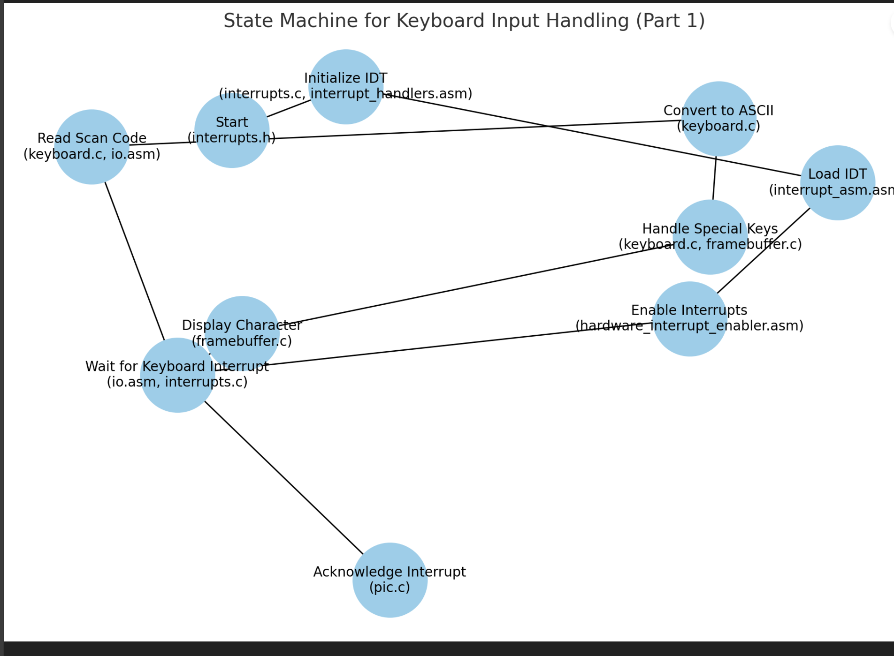
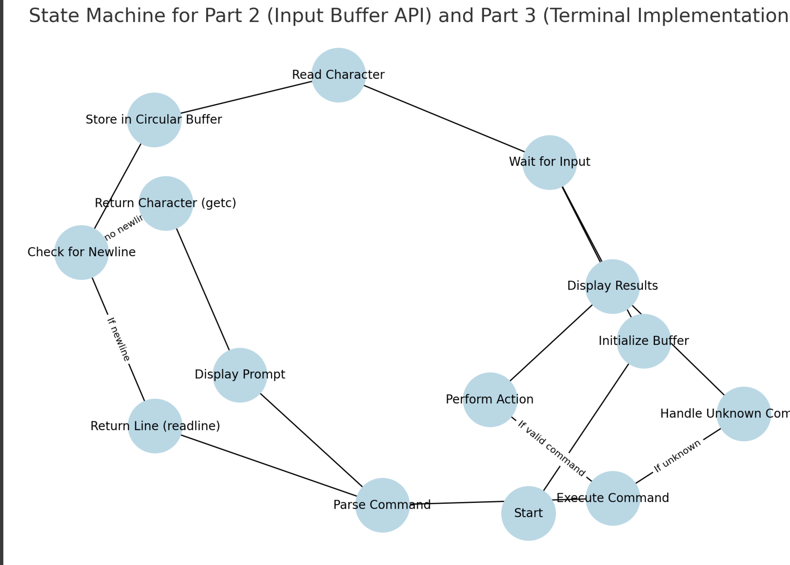

# Overview of worksheet2pt

please see directory **worksheet1/src** for ws1 , **worksheet2** for ws2 part 1 and **worksheet2p2** for ws2 part 2. each have their own README.MD

This part of the worksheet is extending from worksheet2.it  focuses on adding ****keyboard**** input to the operating system, allowing users to **type** and interact with the OS. The main goal is to handle ****keyboard**** input using **interrupts**, which are special signals that pause the current program to handle an important task, like reading what the user types.

- Key tasks include:

1. Setting up the Interrupt Descriptor Table (IDT) to manage **interrupts**.
2. Configuring the Programmable Interrupt Controller (PIC) to handle ****keyboard**** signals.
3. Writing interrupt handlers to process ****keyboard**** inputs, convert them from scan codes to letters, and display them on the screen.
4. Creating an input buffer to store what the user types so it can be processed.

5. Building a simple terminal (like a basic command-line) where users can **type** commands like echo, clear, and help, and see responses.
This task uses both assembly and C programming to teach how the OS interacts with hardware, making the system more interactive. By the end, the OS will be able to respond to user input and run simple commands, laying the groundwork for more advanced features.

## files created and used:
1. **hardware_interrupt_enabler**.h

- **Purpose**: Declares functions to enable and disable hardware **interrupts**.
- **Functionality**: Provides clean interfaces for `enable_hardware_interrupts()` and `disable_hardware_interrupts()` functions, which control whether the CPU responds to **interrupts**. These functions make interrupt management easier and more readable in higher-level code.

2. **hardware_interrupt_enabler**.asm

- **Purpose**: Implements the enable and disable interrupt functions in assembly.
- **Functionality**: Uses the `sti` instruction to enable hardware **interrupts** and `cli` to disable them. These instructions directly interact with the CPU to control interrupt handling globally.

3. **interrupt_asm**.asm

- **Purpose**: Provides the assembly-level implementation for interrupt handlers.
- **Functionality**: Sets up interrupt routines, including `interrupt_handler_33` for ****keyboard**** input. It saves the CPU state, calls the common interrupt handler in C, and restores the CPU state after handling the interrupt. This ensures that **interrupts** don't interfere with the current program state.
4. **interrupt_handlers**.asm

- **Purpose**: Facilitates passing control to a common handler for all **interrupts**.
- **Functionality**: Defines macros for interrupt handling, pushes relevant data (like the interrupt number) onto the stack, and ensures the correct flow of execution between assembly and C-level handlers.
5. **interrupts**.c

- **Purpose**: Implements high-level interrupt handling and descriptor table setup.
- **Functionality**: Initializes the Interrupt Descriptor Table (IDT) to map specific **interrupts** (like the ***keyboard***) to their handlers. It processes ****keyboard**** inputs and communicates with the Programmable Interrupt Controller (PIC) to handle and acknowledge **interrupts**.

6. **interrupts**.h

- **Purpose**: Declares structures and functions for handling **interrupts**.
- **Functionality**: Defines the IDTDescriptor structure and provides prototypes for setting up and handling **interrupts**, such as `interrupts_install_idt()` and `interrupt_handler()`.

7. **io**.h

- **Purpose**: Declares functions for low-level I/O operations.
- **Functionality**: Provides inb() for reading from `I/O `ports and `outb()` for writing to them. These functions are used to communicate directly with hardware devices like the ****keyboard**** and PIC.

8. **io**.s

- **Purpose**: Implements low-level I/O operations in assembly.
- **Functionality**: Contains the actual `inb` and `outb` instructions for reading from and writing to I/O ports. These are essential for configuring and interacting with hardware devices.

9. ****keyboard****.h

-  **Purpose**: Declares functions for handling ****keyboard**** input.
- **Functionality**: Defines prototypes like `keyboard_read_scan_code()` and `keyboard_scan_code_to_ascii()` for reading ****keyboard**** scan codes and converting them into ASCII characters.

10. ****keyboard****.c

- **Purpose**: Implements the functionality to process ****keyboard**** inputs.
- **Functionality**: Reads scan codes from the ****keyboard****, converts them to ASCII, and processes special keys like backspace and enter. It also manages the interaction between the ****keyboard**** and the **framebuffer** to display input.

11. **pic**.h

**Purpose**: Declares constants and functions for configuring the PIC.
**Functionality**: Provides definitions for PIC commands and functions like `pic_remap()` to configure interrupt numbers and `pic_acknowledge()` to signal that an interrupt has been handled.

12. **pic**.c

- **Purpose**: Implements functionality to interact with the PIC.
- **Functionality**: Reconfigures the interrupt numbers to avoid conflicts and ensures smooth communication between the PIC and the CPU. It is essential for managing external hardware **interrupts** like the ****keyboard****.

13. **type**.h

- **Purpose**: Provides consistent **type** definitions and basic constants.
- **Functionality**: Defines types like `u8int`, `u16int`, and `u32int` for unsigned integers of different sizes. It also includes color constants for the **framebuffer**, such as `BLACK` and `LIGHT_GREY`.
### Files from Worksheet 2 and extending here
14. **framebuffer**.h

- **Purpose**: Declares functions for **framebuffer** operations.
- **Functionality**: Includes functions to write characters, move the cursor, set colors, and clear the screen. These are used for outputting text and graphics to the screen.

15. **framebuffer**.c

- **Purpose**: Implements the **framebuffer** functionality.
- **Functionality**: Handles writing text to the screen, managing cursor movement, and clearing the screen using memory-mapped I/O. It interacts directly with video memory to display content.
16. **kmain.c**

- **Purpose**: The main entry point of the kernel.
- **Functionality**: Initializes the **framebuffer** and sets up the kernel environment. It also handles tasks like displaying text on the screen and processing **keyboard** inputs. This file serves as the central coordination point for the kernel.

## part 1 : 

### workflow expected:

1. when the keyboard is pressed , it sends a scan code to the CPU.
2. The CPU pauses its current task and triggers the `interrupt_handler` in `interrupts.c`.
3. The scan code is read from the keyboard hardware by calling `keyboard_read_scan_code()`.
4. The scan code is converted into an ASCII character using `keyboard_scan_code_to_ascii().`
5. Depending on the ASCII character:
    - If it’s a backspace, the last character is removed.
    - If it’s enter, the cursor moves to a new line.
    - For regular characters, it is displayed on the screen.
6. The interrupt is acknowledged using `pic_acknowledge()` to signal the PIC.
7. The framebuffer is updated to reflect the changes.
#### Interrupt Handling Setup:

 `interrupts.c`

- This file defines the `interrupt_handler` function, which is responsible for managing different types of hardware interrupts, including **keyboard** input.
- The **keyboard** interrupt is identified by its interrupt number `(INTERRUPTS_KEYBOARD)`, which is linked to the **keyboard** hardware through the Programmable Interrupt Controller (PIC).

#### Reading Scan Codes:

 `keyboard.c`,` io.h`, `io.asm`

- `keyboard_read_scan_code()`: This function is defined in **keyboard.c** and is used to read raw scan codes from the **keyboard** using the I/O port `0x60`.
- `inb()`: This assembly-level function in `io.asm` reads a byte from the specified hardware port. It's used here to fetch the **keyboard** scan codes.
Purpose: A scan code is a number sent by the **keyboard** hardware whenever a key is pressed or released. 

#### Converting Scan Codes to ASCII:

 `keyboard.c`

- `keyboard_scan_code_to_ascii()`: Converts scan codes into ASCII characters. This function includes a mapping from scan codes (e.g., 0x10 for 'q') to their corresponding ASCII characters.
-  This step converts the raw hardware data into a usable format (e.g., letters, numbers, or special characters).

#### Handling Special Cases:

Special Cases Implemented in `interrupts.c`:

- Backspace:
When the scan code for backspace is detected `('\b')`, the cursor moves back, and the framebuffer removes the last character displayed.
    -  Function Used: `fb_backspace()`  in `framebuffer.c`.

- Enter: When the scan code for enter ('\n') is detected, the cursor moves to a new line.
    - Function Used: `fb_newline()` in `framebuffer.c`.
-  Regular Characters:
For standard characters, the ASCII value is passed to `fb_write_char(ascii)` to display the character on the screen at the current cursor position.

#### Acknowledging the Interrupt:

` pic.c`

- `pic_acknowledge()`: Signals to the Programmable Interrupt Controller (PIC) that the **keyboard** interrupt has been handled. This ensures the system is ready to process the next interrupt.

-  If this step is skipped, the PIC may assume the interrupt is still pending and will not allow further interrupts to be processed.

#### Updating the Framebuffer:

` framebuffer.c`

- Functions like `fb_write_char`, `fb_backspace`, and `fb_newline` is for the framebuffer to display characters, remove them, or move the cursor.
-  The framebuffer is where text is rendered on the screen. Updating it ensures the user sees the output of their key presses.

###  Running the OS using Makefile

1. **Build the Kernel and ISO**: Before running, ensure the kernel.elf and os.iso files are built using the all target or other related targets in the Makefile.

2. **Execute make run**: Run the make run command from the terminal. This will:

3. **Build the os.iso** if it's missing or outdated.
Using QEMU to boot your OS.

4. **View the Output**:

#### writing : 

#### backspace:

#### newline:

## part 2 : 
In Part 2 of Worksheet 2, the goal is to create a system to handle keyboard input more effectively. This involves storing user input in a buffer and providing two main functions `(getc()` and `readline()` to manage and retrieve the input in an organized way.
### workflow expected:

1. `getc()` Function:

- Takes one character from the input buffer and returns it. After returning the character, it removes it from the buffer.

- If the buffer is empty, it handles this situation properly (e.g., by not trying to read anything).
- Uses a circular buffer, which is a special type of buffer that reuses space efficiently by "wrapping around" when it reaches the end.
- This function can be used by other parts of the operating system to get characters from the keyboard input.

2. `readline()` Function:
- Reads all the characters the user types until they press "Enter" (newline \n) and stores them in a buffer (like a temporary storage area for text).

- Calls the `getc()` function repeatedly to retrieve characters one by one.
- Saves each character in the provided storage space until the user presses `"Enter."`
- Checks the buffer size to ensure it doesn’t overflow and handles errors if the input is too long.
3. Things to Consider:
- Managing Input:

    - Use a circular buffer to store input, making sure memory is used efficiently without wasting space.
    - Avoid errors like trying to read from an empty buffer or overloading the storage when input is too long.
- Keeping Everything in Sync:

Since the system gets input from the keyboard using interrupts (which happen automatically when the user types), the program needs to carefully manage how it reads from the buffer so it doesn’t cause conflicts.
- Handling Errors

### files used
- `keyboard.h`
- `keyboard.c`: Custom Buffer Management :

    - **Purpose**: Implements the circular buffer for storing input and functions like getc() and readline().
    -   **Usage**:
        Provides the storage for input characters.
        Handles adding and removing characters from the buffer efficiently.

- `interrupts.c`
- `io.h`
- `io.asm`
- `types.h`

### workflow expected of pt2 and pt3:

